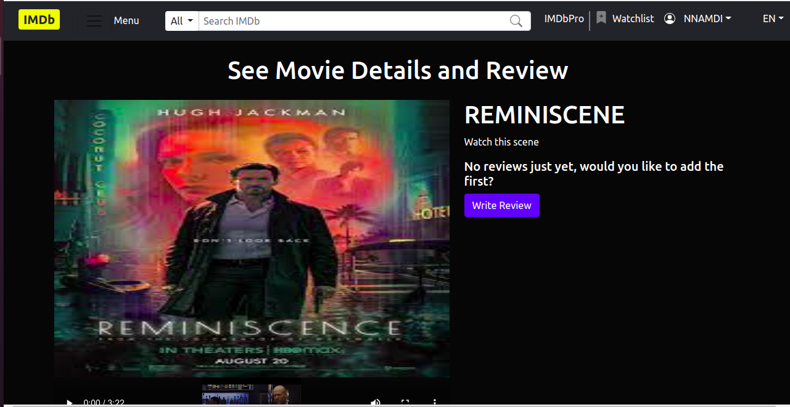

## Movie Review App (IMDb Clone)

## Developed by EMELU NNAMDI A
## JetThoughts Test Project

This is a movie review project. The home page displays the list of different movies. Users who visit this site will get information about the listed movies. Each movie comes with a video clip that shows the highlight of the movie. Only users who are registered on the site will be allowed to review or rate a movie. Unregistered users who will attempt to see movie details or rate a movie will be directed to the login page.
Registered users can sign in to the app using their email and password. Signed-in users will have the privilege to see each movie's details by clicking on the plus icon at the top left corner of each movie. This icon will open the movie details page. The movie's details page displays the various star rating of that movie by different users as well as the average rating. Information such as movie title, director, description movie-length, category, clip, and thumbnail images are displayed. The user can click on the review button to add his/her review. The movie is listed in a horizontal row. The movie list has a pagination feature that loads six movies in a row. The pagination feature allows users to move front or backward to see more movies. Signed-in users will also see a selection field at the top right corner of the movie list. This will help them to sort the movie according to their categories. If a logged-in user is an admin, the Admin Panel link will also be displayed at the top right corner below the navigation area. The Admin panel is implemented using the rails admin gem. It helps the admin to manage and perform CRUD actions on the app.

## Viewing Page

This project is designed to work on a desktop or large screen at this time. Responsiveness will be implemented in the future time. 

## Preview

## Cover Page


## Details Page One


## Details Page two


## Movie Display


## Admin Home Page

## Features 
- Users can sign up in the app.
- Users can log in after signing up. 
- Signed-in users can see movie details.
- Signed-in users can rate the movie from the details page.
- Movie can be sorted based on category.
- Users use the pagination feature below the movie list to see more movies.
- Movie details page displays the average rating for each movie.
- Movie Rating from 1 to 10.
- Admin panel to perform CRUD action and manage movies.

## Project SetUp/Installation

Get a local copy of the file. Clone with HTTPS using the command below.

```
git clone https://github.com/Zubenna/movie_review_project.git
```
## Access project folders 
```
cd movie_review_project
```
## Install all the dependencies
```
bundle install
```
## Create the database with the following command
```
rails db:create
```
## Migrate the database with the following command
```
rails db:migrate
```
## Populate the database with the following command
```
rails db:seed
```
## Run Application test while on the project root with the following 

### Type rspec in the project root to run tests.
```
rspec
```
## Run the server
- While in the project root, start rails server with the command 'rails server'.
- In your browser, type http://localhost:3000 to access the app.
- You can now sign up or log in, to test all features.

## Test Project With the Following Accounts

- email: userone.email@example.com, password: 123456 (Admin User)
- email: userthree.email@example.com, password: 123456 (Normal User)

## Before testing
- Login with the admin account and create at least three movies for each category listed in the movie selection area. This is to enable see all the features and avoid brealing the app.

## Uploading Files
- Do not exceed 20MB for video and 5MB for thumbnail image while creating movies.

## Live Version
- [Launch App]( Yet to be added )

## Built With
- Ruby, Ruby on Rails
- RSpec, Capybara, Rails admin, will paginate gem
- HTML
- CSS
- Rails Active Storage for file uploads.

## Author

👤 **Nnamdi Emelu**
- Github: [@zubenna](https://github.com/zubenna)
- Twitter: [@zubenna](https://twitter.com/zubenna)
- Linkedin: [nnamdi-emelu](https://www.linkedin.com/in/nnamdi-emelu/)

##  Contributing

Contributions, issues, and feature requests are welcome!

Feel free to check the [issues page](https://github.com/Zubenna/movie_review_project/issues/new)

## Show your support

Give a star if you like this project!

## Acknowledgments
- JetThoughts Test Projec
